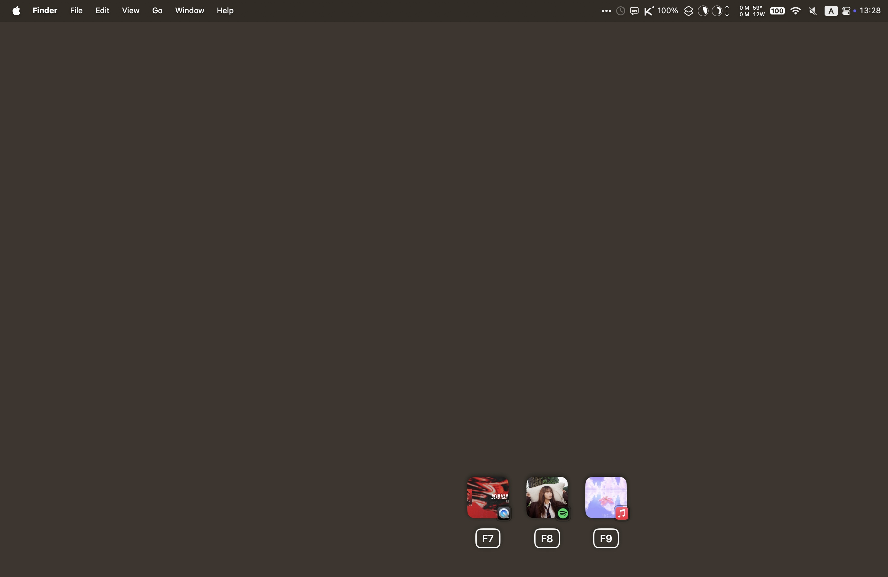

# Threek

> Because it's funny.

A macOS menu bar app that intercepts the ⏯ key and lets you choose **which app**
receives the command when several apps are registered with Now Playing at the
same time — playing *or paused*.

**[Download](https://github.com/LPFchan/Threek/releases/latest/download/Threek.dmg)** · [threek.lost.plus](https://threek.lost.plus) · macOS 15+, Apple silicon and Intel



---

## What it does

macOS hands play/pause to whichever app most recently claimed the Now Playing
session. With Spotify, Music, and a browser tab all paused at once, pressing ⏯
is a lottery. Threek intercepts the key, enumerates **every** app in the Now
Playing registry, and pops up a HUD so you pick the target. Apps are listed
alphabetically, so each one keeps its F-key from one press to the next.

| # of apps | Behavior |
|---|---|
| 0 | Re-injects the key so the system handles it normally. |
| 1 | Sends the key directly to that app and briefly shows it over the key you pressed. |
| 2 | HUD shows two icons. ⏮ sends left, ⏭ sends right. |
| 3 | HUD shows three icons. ⏮ / ⏯ / ⏭ map to the three apps. |
| 4+ | HUD shows a scrollable row. ⏮/⏭ move a selection ring, ⏯ confirms. |

If exactly one app is actually playing, any media key goes straight to it; the
HUD just flashes that app over the key, no picking needed. ⏮/⏭ follow the same routing as ⏯. Threek reads the real F7–F9 media
keys, so no Karabiner remapping is needed.

To show only app icons, turn off **Show Album Artwork** in the menu bar menu.

With several displays, the HUD appears on the one the cursor is on; on the
built-in display it lines up with the F7–F9 keys.

Hold ⏯ for half a second to pause everything that's playing; the HUD shows
each app it paused. A normal tap still acts on release, so it works as before.

QuickTime Player gets one entry per open video or audio file, with the file's
own frame or cover art, so each one can be paused on its own. QuickTime has no
tracks, so ⏮/⏭ do nothing for it.

---

## How it works (macOS 15.4+)

Since **macOS 15.4**, the `mediaremoted` daemon refuses to hand Now Playing data
to third-party processes — `MRMediaRemoteGetNowPlayingClient(s)` returns empty
from any unsigned context. This is why the original implementation broke.

Threek v2 works around the entitlement wall using the bundled
[**MediaRemote Adapter**](https://github.com/ungive/mediaremote-adapter)
(vendored in `Vendor/`): it spawns `/usr/bin/perl` — a system binary that *is*
entitled — and loads a small helper framework that talks to MediaRemote and
reports back as JSON.

On top of the stock adapter, Threek adds a **`clients`** command
(`Vendor/mediaremote-adapter/src/adapter/clients.m`) that enumerates **all**
registered Now Playing apps, including paused ones — the data the stock
single-active-app `get`/`stream` commands can't provide.

| Concern | Mechanism |
|---|---|
| **Discovery** (which apps, incl. paused) | `mediaremote-adapter.pl … clients` inside the perl shim |
| **Identity** | bundleID, displayName, PID, parent bundleID (collapses WebKit/browser helpers) |
| **Send play/pause** | AppleScript (`osascript`) to the picked app; falls back to the adapter's `MRMediaRemoteSendCommand` (current now-playing app) when AppleScript isn't possible |

The framework is **built from source** by `scripts/build-adapter.sh` (a Xcode
pre-build phase) — no committed binaries.

---

## Install

1. Open `Threek.dmg` and drag **Threek** into **Applications**.
2. Open Threek. macOS refuses the first launch because the app isn't notarized
   by Apple: go to **System Settings → Privacy & Security**, scroll down, click
   **Open Anyway**, and open it again.
3. A short welcome walks you through allowing Threek under **Privacy &
   Security → Accessibility**, so it can see the media keys.
4. The first time Threek controls a media app, macOS asks for **Automation**
   access to it. Allow it once per app.

Threek updates itself through [Sparkle](https://sparkle-project.org). The menu
bar icon has Enabled, Open at Login, Check for Updates and About. The UI is in
English and 28 other languages.

---

## Build from source

**Prerequisites:** Xcode 16+, [XcodeGen](https://github.com/yonaskolb/XcodeGen), CMake

```bash
git clone https://github.com/LPFchan/Threek.git
cd Threek
brew install xcodegen cmake   # if needed
xcodegen generate
open Threek.xcodeproj
```

Set your Development Team in `project.yml` (or Xcode → Signing & Capabilities),
then ⌘R. The adapter framework builds automatically as a pre-build phase.
Debug builds add a **Preview HUD** menu item (⌘P) for checking the picker.

`sh scripts/build-app.sh` builds the release app into `build/Threek.app`
(universal, version from the latest `v*` tag, build number = commit count)
and `sh scripts/make-dmg.sh` packs it into `build/Threek.dmg` with
[DMGMaker](https://github.com/saihgupr/DMGMaker) and the background from
`Packaging/dmg-background.html` (re-render it with
`scripts/make-dmg-background.sh`). `swift scripts/make-icon.swift` redraws
the app icon.

---

## Releasing

Push a version tag: `git tag v1.0.0 && git push origin v1.0.0`.
`.github/workflows/release.yml` then builds and signs the app, packs the DMG,
publishes a GitHub release, and adds it to `docs/appcast.xml`, the Sparkle
update feed. GitHub Pages serves `docs/` at `threek.lost.plus` (a DNS-only
Cloudflare CNAME to `lpfchan.github.io`), which is also the homepage.

It needs three repository secrets:

- `SPARKLE_PRIVATE_KEY`: signs updates; the app only installs updates signed
  with it. Its public half is `SUPublicEDKey` in `project.yml`.
- `SIGNING_CERT_P12`, `SIGNING_CERT_PASSWORD`: the "Threek Self-Signed"
  code-signing certificate (base64 .p12). Gatekeeper doesn't trust it, but
  keeping the same one means macOS remembers the Accessibility grant across
  updates.

GitHub can't show secrets again; backups live in passage (folder `sparkle`)
and in the maintainer's login keychain (Sparkle account `threek`). Losing the
Sparkle key means existing installs can never update again.

---

## Project structure

```
Threek/
├── project.yml                 # XcodeGen — no .pbxproj committed
├── scripts/
│   ├── build-adapter.sh        # Builds MediaRemoteAdapter.framework from source
│   ├── build-app.sh            # Release build + signing → build/Threek.app
│   ├── make-dmg.sh             # build/Threek.dmg via DMGMaker
│   ├── appcast.py              # Adds a release to docs/appcast.xml
│   └── make-icon.swift         # Draws the app icon
├── Packaging/                  # DMG background + DMGMaker patch
├── docs/                       # threek.lost.plus: homepage + Sparkle feed
├── Vendor/
│   └── mediaremote-adapter/    # Vendored adapter (BSD-3) + our `clients` command
├── App/
│   ├── ThreekApp.swift         # @main
│   └── AppDelegate.swift       # Event tap lifecycle, menu bar, routing
├── MediaKeys/
│   ├── MediaKeyInterceptor.swift
│   └── MediaKeyEvent.swift
├── NowPlaying/
│   ├── NowPlayingService.swift # Perl-shim discovery + AppleScript dispatch
│   └── NowPlayingApp.swift     # Model
├── Popup/
│   ├── PopupController.swift   # NSPanel + SwiftUI HUD
│   └── SelectorViewModel.swift # State machine
├── Preferences/
│   └── LaunchAtLogin.swift
└── Resources/                  # App icon, Localizable + InfoPlist string catalogs
```

---

## Privacy

- No analytics. No telemetry. The only network request is Sparkle's update
  check against `threek.lost.plus/appcast.xml`.
- Now Playing metadata stays in-process.
- Accessibility is used only to intercept hardware media-key events.

---

## Known limitations

- Only apps that register with macOS Now Playing are discoverable.
- The adapter relies on a private-API workaround Apple could close in a future
  macOS release. `mediaremote-adapter.pl … test` detects this at runtime.

---

## Credits

- [mediaremote-adapter](https://github.com/ungive/mediaremote-adapter) by Jonas
  van den Berg (BSD 3-Clause) — the entitlement workaround that makes v2
  possible. License in `Vendor/mediaremote-adapter/LICENSE`.

---

## License

MIT — see [LICENSE](LICENSE).
